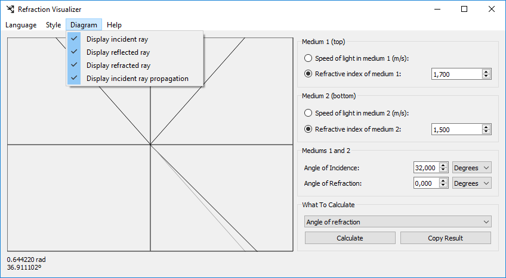
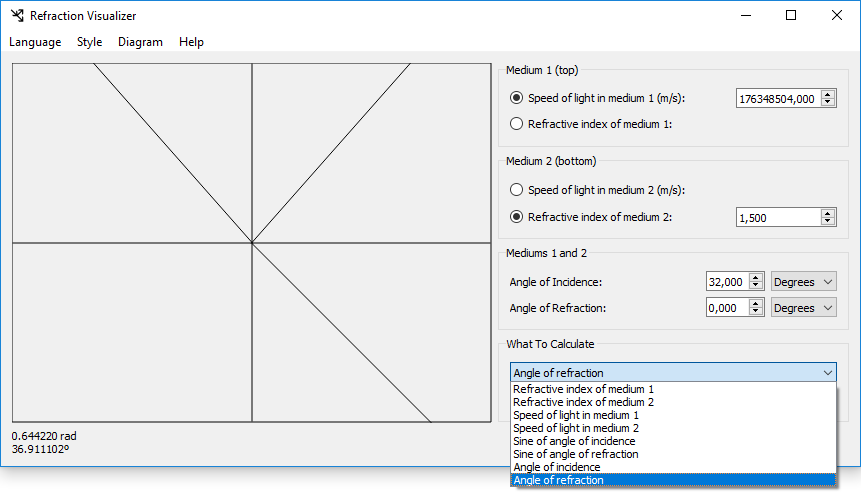

# Refraction Visualizer

Refraction Visualizer allows you to calculate such things as the angles of
incidence and refraction, the speed of light in two mediums, and the
refractive index of two mediums. It displays the results in a diagram
showing the path a ray of light takes through two mediums.

This is a hobby project of mine and it is ready for real-world use.
I will not accept pull requests.

# License

Refraction Visualizer Copyright (C) 2009-2022 Daniel T. McGinnis

Refraction Visualizer is licensed under the GNU AGPLv3 license as published by the Free Software Foundation.
